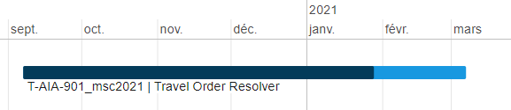
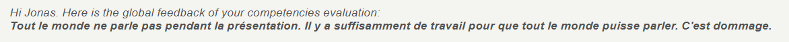

# Travel Order Resolver - T-AIA-901 (Partie Web)

# Sommaire

- [Travel Order Resolver - T-AIA-901 (Partie Web)](#travel-order-resolver---t-aia-901-partie-web)
- [Sommaire](#sommaire)
- [Presentation](#presentation)
- [Technologies](#technologies)
- [Environnement](#environnement)
  - [Dates](#dates)
  - [Temps à disposition](#temps-à-disposition)
  - [Projets en parallèle](#projets-en-parallèle)
- [Fonctionnalités](#fonctionnalités)
- [Equipe et répartition du travail (Partie Web)](#equipe-et-répartition-du-travail-partie-web)
  - [Membres de l'équipe (Partie Web)](#membres-de-léquipe-partie-web)
- [Notation](#notation)
- [Liens](#liens)

# Presentation

Projet de NLP (Natural Language Processing) où l'utilisateur peut dicter un trajet qu'il aimerait faire et l'IA identifie les villes dans le bon ordre avant de retourner la liste des gares pour réaliser le trqjet le plus rapidement possible.
Les requêtes des utilisateurs peuvent par exemple être : "Je suis à Paris et je veux aller à Strasbourg avec mon amis Frank que je récupère à Mulhouse".

# Technologies
* Spacy

# Environnement
Semestre 9 *(premier semestre de M2)*

## Dates
* **Début :** 2020-09-07
* **Fin :** 2021-02-28

## Temps à disposition
**Nombre total de jours :** 35 (7 semaines; 1,75 mois)  
*Detail :*
* *Nombre de jours par semaine en cours : 1*
* *Nombre de semaines alternées : 20*
* *Nombre de semaines complètes en cours : 3*
* *Nombre de jours fériés : 0*

## Projets en parallèle 
* [T-ESP-900](https://github.com/HaberkornJonas/ManageMint_Frontend_T-ESP-900)
* [T-DAT-901](https://github.com/HaberkornJonas/Image-Recognition_T-DEV-810)

# Fonctionnalités
* L'utilisateur clique sur le bouton et formule sa requête. L'IA lui retourne le chemin le plus court pour réaliser son voyage en train

# Equipe et répartition du travail (Partie Web)
**Nombre de commit total :** 18  
**Chef de projet :** Haberkorn Jonas
**Documentation réalisée par :** Haberkorn Jonas  
**Diaporama de présentation réalisé par :** Haberkorn Jonas

## Membres de l'équipe (Partie Web)
* **Kocaoz Ogün**
  * Etudiant à : Strasbourg
  * Nombre de commits : 14
  * Tâches implémentées :
    * Setup de l'interface web
    * Setup du serveur HTTP Python
* **Haberkorn Jonas**
  * Etudiant à : Strasbourg
  * Nombre de commits : 3
  * Tâches implémentées :
    * Cleaning project
    * Improved display, usability and fixed bugs
* **Ibrahim Bila Maina Ari**
  * Etudiant à : Paris
  * Nombre de commits : 1
  * Tâches implémentées : -
* **Sattler Sébastien**
  * Etudiant à : Strasbourg
  * Nombre de commits : 0
  * Tâches implémentées : -

# Notation
**Référent pédagogique** : Moreel Nicolas (Paris)
  
**Proportion des compétences validé :** 80%    

**Retour pédagogique :**   

Feedback  

# Liens
* [Projet](project)
* [Sujets](documents/subject)
